# Purpose of application
The application is intended to be used by an administrator who will retrieve a json file via an API call from an external system .
It is intended that the administrator can add new records to the JSON file, modify, delete, update statuses etc.
The updated JSON would then be consumed by the external system API to update the master data in the external system.

### Technical overview of application
The application is written in python and uses standard libraries including tkinter & JSON. All the algorithms and functions run on one single form.

# Running the toolkit application in Codio
Copy the application artefacts
Copy the toolkit.py, ast.json, logfile.log resources and README.md file from the supplied package to the root of the Codio lab/platform.

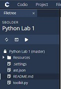

Fig1. Files.jpg

### Create a virtual machine
Use **Tools > Install Software** and install X server.

### Configure X server
Once X server is installed configure it to run the toolkit.py script.
Use **Virtual Desktop > Configure** under the command node enter the following text - "Run Python (tkinter)": "python3 toolkit.py"

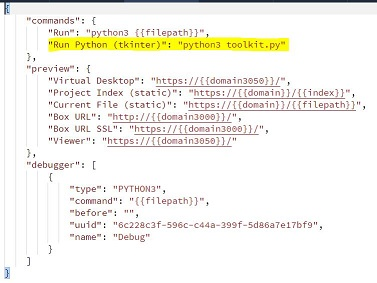

Fig2. Xserverconfig.jpg

### Run your code
Click **Run Python (tkinter)** menu to execute the toolkit.py script.

### Launch the User interface
Click **Virtual Desktop** to execute the user interface.

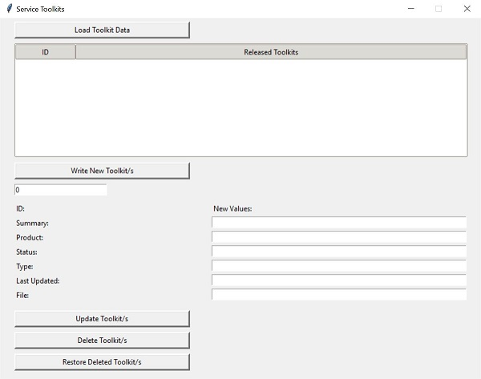

Fig3. Application.jpg

### Load JSON data
Click the 'Load Toolkit Data' Button.
This will populate the Released Toolkits list box with all data that matches the status of R (Released) and U (Unreleased).
These values will determine if the toolkit is available in the external system.
The data in this list box is sorted/ordered by the numeric ID of each record in ascending order. The order is based on the first to last
record as per the order in the JSON file.

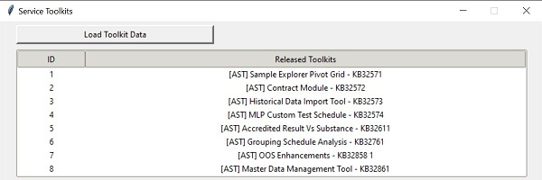

Fig4. Loadeddata.jpg

### Write new records to the JSON file
The application allows you to add new objects to the JSON file. This can be done by entering a value between 1 and 10 in the input control
under the 'Write New Toolkit/s' button. If an accepted value is added the application will take a count of current objects in the JSON file and increment the count to add X number of new records with a sequential numeric ID. 
The detail of the values for that record will be Generic so they can be modified, and the objects will be marked as 'Unreleased'.

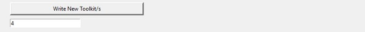
Fig5. Recordstoadd.jpg

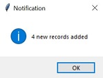

Fig6. Recordsaddedmsg.jpg

The listview will refresh automatically

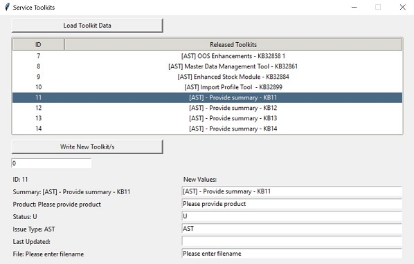

Fig7. Recordsadded.jpg

### Incorrect or blank value inserted
A message will appear if you leave the input field blank,0 or enter a number larger than 10.

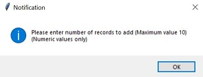

Fig8. Zerorecordsaddedmsg.jpg

Fig9. Zerorecordsaddedmsg_1.jpg

### Updating records
Select a record in the list view. The label and input controls will be populated with all the records data. Update values in the input controls and click the ‘Update Toolkit/s’ button.

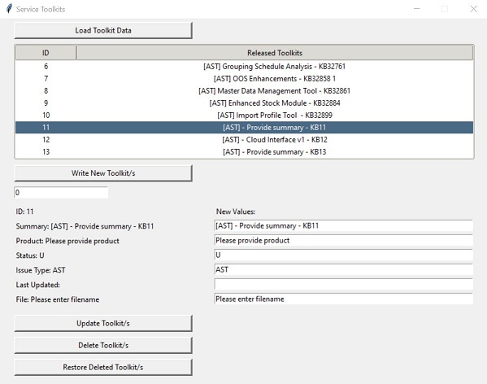

Fig10. Updateselectedvalues.jpg

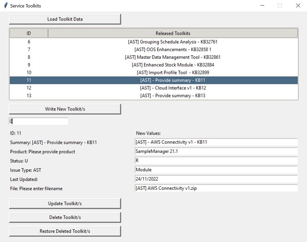

Fig11. Updatedselectedvalues.jpg

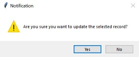

Fig12. Updateselectedvaluesmsg.jpg

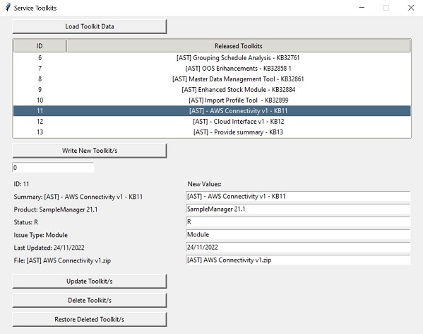

Fig13. Updatedvalues.jpg

### Deleting records
Select a record in the list view. Click the ‘Delete Toolkit/s’ button. A notification will appear asking if you want to delete the record. If ok to the message a notification will appear to tell you it has been deleted. The listview on the form will auto refresh and the record will have disappeared.

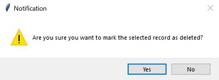

Fig14. Deletedrecordmsg.jpg

Fig15. Deletedrecordmsg_1.jpg

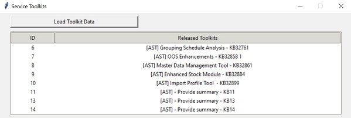

Fig16. Deletedrecordlist.jpg

### Restoring deleted records
Click the ‘Restore Deleted Toolkit/s’ button. The listview control will refresh and any deleted records will reappear.

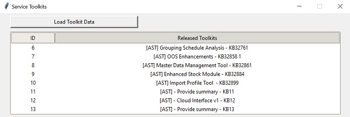

Fig17. Restoredlist.jpg
