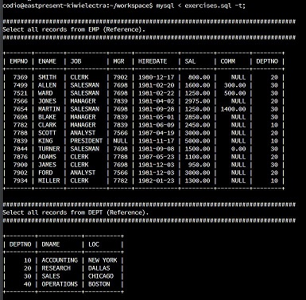
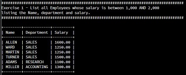
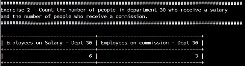
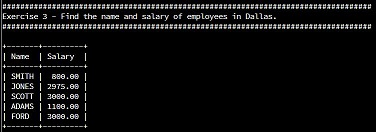
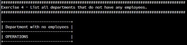
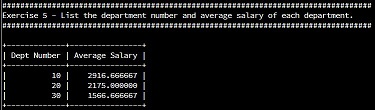

## Using/Configuring the `mysql` client
Open up the config for 'Run sql file (press twice)' by clicking on the menu **Run sql file (press twice) > Configure**

When the .codio file open place the following in the commands section - 
  "commands": {"Run sql file (press twice)":"mysql < exercises.sql -t;"}.
This will execute mysql in the terminal window and then call the exercises.sql script and finally -t will format the output from any transaction into a readable table in the terminal window. 
The SQL script holds the function to use the 'COMPANY1' database.

This removes the need to call mysql, the database and then the sql and can be executed with one action.

## Running `mysql` statements
Click **Run SQL Exercises**

## Reading output
Once the **Run SQL Exercises** has been run the terminal output will contain results for all the exercises.
The script contains comments on each script that can be read inline in the exercises.sql itself but the script will also output information to the terminal to make the output more readable.

The first 2 outputs are the full EMP and DEPT table contents. 
This is for reference so the content of the exercise queries can be checked.

## Output/results
This section shows the output/results of each of the individual tasks (1-5).

1.

2.

3.

4.

5.

